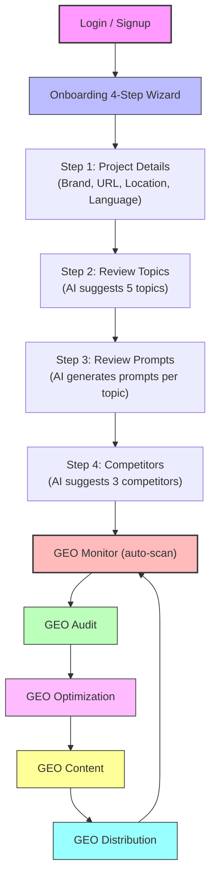

# Alignment Agent — User Flow & Module Summary

**Version:** 2.0  
**Last Updated:** 2026-02-11  
**Status:** Production  
**Author:** Alignment Product Team

---

## 1. User Flow

### Typical User Journey

1. **Login** → redirects to **Onboarding** (every time, for demo purposes)
2. **Onboarding** (4 steps) → collects brand info, topics, prompts, competitors → auto-prefills all 5 GEO modules → redirects to **GEO Monitor** with `?autoScan=true`
3. **GEO Monitor** → auto-triggers first scan → user sees AI visibility data across 6 tabs
4. **GEO Audit** → user diagnoses if their website is AI-ready (5-dimension scoring)
5. **GEO Optimization** → generates code snippets to fix audit issues (5 dimensions)
6. **GEO Content** → generates AI-optimized articles (7 content types) with validation
7. **GEO Distribution** → finds best channels to publish content for AI citation
8. **GEO Monitor** → monitors whether above actions improved AI visibility

---

## 2. Onboarding — 4-Step Wizard

| Step | User Input | System Action | Output |
|------|-----------|---------------|--------|
| **Step 1: Project Details** | Brand Name, Brand URL, Location, Language, Timezone | Validates inputs | Stores project context |
| **Step 2: Review Topics** | Review/select AI-suggested topics (5 default); can add custom topics | `POST /api/onboarding/suggest-topics` (LLM) | 5 business topics relevant to AI visibility |
| **Step 3: Review Prompts** | Review/select AI-generated prompts for each topic | `POST /api/onboarding/generate-prompts` (LLM) | Prompt list covering 4 intent categories |
| **Step 4: Competitors** | Review/select AI-suggested competitors (3 default); can add custom ones | `POST /api/onboarding/suggest-competitors` (LLM) | Competitor list for monitoring |

**On Complete:**
- Brand config saved to `localStorage` → pre-fills GEO Monitor, Audit, Optimization, Content, Distribution
- Selected prompts created in GEO Monitor via `POST /api/monitor/prompts`
- Redirects to `/dashboard/geo-monitor?autoScan=true`

**Persistence:**
- All onboarding data stored in `localStorage` (restored on revisit)
- Custom-added topics & competitors persist across sessions
- Version migration ensures updated defaults for returning users

---

## 3. Five Core GEO Modules — Detailed Summary

### Module 1: GEO Audit

| Sub-Feature | Description | User Gets |
|-------------|-------------|-----------|
| **URL Input** | Enter website URL to audit | Accepts URLs with/without protocol, validates format |
| **5-Dimension Scoring** | D1: AI Accessibility (15%), D2: Semantic Structure (20%), D3: Content Citability (30%), D4: Risk Boundary (20%), D5: Reusability/Memory (15%) | Score 0-100 per dimension, overall score, letter grade (A+ to F) |
| **Radar Chart** | SVG pentagon visualization of 5 dimensions | Visual comparison of dimension scores |
| **Quick Insights** | Highlights strongest dimension & priority-to-fix dimension | Immediate action guidance |
| **Dimension Detail Cards** | Expandable cards per dimension with findings (pass/warn/critical) and recommendations | Specific checks (e.g., "robots.txt blocks GPTBot") and fixes |
| **Audit Summary** | Total checks, passed, warnings, critical issues, top recommendations | Prioritized action list |
| **Next Steps CTA** | 3 cards: "Optimize Now" → GEO Optimization, "Create Content" → GEO Content, "Monitor Visibility" → GEO Monitor | Cross-module navigation |
| **localStorage Persistence** | URL, result, audit state saved | Results persist across page navigation |

---

### Module 2: GEO Optimization

| Sub-Feature | Description | User Gets |
|-------------|-------------|-----------|
| **URL Input** | Enter URL (can receive URL from GEO Audit CTA) | Auto-triggers optimization if navigated from Audit |
| **5-Dimension Optimization Plans** | For each dimension: current score → projected score, stability classification (Structural/Content/Hybrid) | Score improvement estimates per dimension |
| **Fix Cards** | Per-fix: title, description, impact points, effort level (low/medium/high), permanent vs ongoing indicator | Actionable fix details |
| **Code Generation** | "Generate" button per dimension → ready-to-copy code snippets (robots.txt, HTML meta, FAQ schema, etc.) | Production-ready code for manual application |
| **Code Preview Modal** | Syntax-highlighted code display with copy-to-clipboard | Easy code extraction |
| **Baseline Snapshot** | Save/load optimization baseline from localStorage | Track progress, detect regressions |
| **Content/Hybrid Links** | Content and Hybrid type fixes link to GEO Content module | Seamless workflow to content generation |
| **localStorage Persistence** | URL, result, optimization state saved | Results persist across page navigation |

---

### Module 3: GEO Content

**4 Tabs:** Generate | Validator | History | Admin

| Tab | Sub-Feature | Description | User Gets |
|-----|-------------|-------------|-----------|
| **Generate** | Content Type Selection | 7 types: Definition, Comparison/Ranking, How-to, FAQ, Evaluation & Risk, Use-case Mapping, Reference/Source | Choose article type |
| **Generate** | Output Channel Selection | Reddit/Community, LinkedIn/Professional, Medium/Blog, Docs/Wiki, Company Blog/PR | Format adapted per channel |
| **Generate** | Brand + Product Input | Separate Brand (required) and Product (optional) fields | Targeted content generation |
| **Generate** | Content Guardrails | Optional forbidden claims / compliance notes | Content safety |
| **Generate** | AI Content Generation | LLM generates full article with 3 title options, TL;DR, main body, FAQ | Complete AI-optimized article |
| **Generate** | Editable AI Prompt | View/edit the prompt sent to LLM | Customize AI instructions |
| **Generate** | Quality Checklist | Structural compliance checks (word count, TL;DR, headers, etc.) | Quality assurance |
| **Generate** | Push to Distribution | CTA link to GEO Distribution queue | Cross-module workflow |
| **Validator** | Drag & Drop Upload | Upload or paste article text for validation | Easy content submission |
| **Validator** | 3-Layer Validation | Structural Contract, Risk Boundary, GEO Compliance checks | Detailed pass/fail per rule |
| **Validator** | Collapsible Results | Expandable sections for each validation layer | Clear issue identification |
| **Validator** | Submit for Review | Enabled only if validation passes → links to GEO Distribution | Gated workflow |
| **History** | Filter & Search | Filter by content type, output channel | Find past generations |
| **History** | Detail Table | Date, type, channel, brand, title, actions | Browse all generated content |
| **History** | View Output Modal | Full article preview in modal | Review past content |
| **History** | Reuse Structure | Pre-fill Generate tab with previous settings | Quick iteration |
| **Admin** | Template Management | Left sidebar: 7 content types, Main area: 3 rule sections per type | Manage content rules |
| **Admin** | Inline Editing | Edit/add/delete rules for Structural Contract, Risk Boundary, GEO Compliance | Customize validation |
| **Admin** | Save to Backend | "Save Changes" persists rules via `PUT /api/content/templates/{type}` | Persistent rule management |

---

### Module 4: GEO Distribution

**4 Tabs:** AI Visibility Channel | AI Visibility Coverage | AI Content Deployment Hub | Reddit Strategy Engine

| Tab | Sub-Feature | Description | User Gets |
|-----|-------------|-------------|-----------|
| **AI Visibility Channel** | Strategy Input | Brand, Domain, Industry, Competitors, Target AI Platform (single-select), Content Type (single-select) | Customized strategy |
| **AI Visibility Channel** | Ranked Channel Recommendations | 20+ channels scored by AI citation probability, per-platform weighting | Prioritized channel list with blended scores |
| **AI Visibility Channel** | Push Content Button | Per-channel CTA to push content to queue | One-click content deployment |
| **AI Visibility Channel** | Reddit Linking | Reddit channels link to Reddit Strategy tab | Specialized Reddit guidance |
| **AI Visibility Channel** | Monitor Data Sync | Optional: reflects GEO Monitor citation data if available | Real data enrichment |
| **AI Visibility Coverage** | Channel Grid Map | All channels with citation status, priority, presence, gap analysis | Visual coverage overview |
| **AI Visibility Coverage** | Gap Identification | Highlights channels where brand is missing | Gap opportunity targeting |
| **AI Visibility Coverage** | Push Content to Gaps | Push content directly to uncovered channels | Fill citation gaps |
| **AI Visibility Coverage** | AI Citation Gap metric | Shows gap opportunity percentage per channel | Quantified gap data |
| **AI Content Deployment Hub** | Queue Table | All pushed content items with status, source tab badge, priority | Unified content pipeline view |
| **AI Content Deployment Hub** | Status Pipeline | Pending → Published → AI Verified (simplified 3-stage) | Clear status tracking |
| **AI Content Deployment Hub** | Batch Operations | Multi-select items, batch status update | Efficient bulk management |
| **AI Content Deployment Hub** | Edit/Delete Items | Modify title, content type, priority, channel, notes | Full queue management |
| **Reddit Strategy Engine** | Subreddit Recommendations | AI-powered subreddit suggestions with relevance scoring | Targeted Reddit channels |
| **Reddit Strategy Engine** | Competitor Intel | Competitor Reddit presence analysis | Competitive intelligence |
| **Reddit Strategy Engine** | Push to Subreddit | Per-subreddit push button with post type (Main Post / Reply) | Reddit-specific deployment |

---

### Module 5: GEO Monitor

**6 Tabs:** Overview | Mentions | Citations & Sources | Competitors | Gap Analysis | Prompts

| Tab | Sub-Feature | Description | User Gets |
|-----|-------------|-------------|-----------|
| **Overview** | Brand Configuration | Brand name, domain, keywords, competitors setup | Monitor configuration |
| **Overview** | Scan Execution | Run AI visibility scan across all active prompts | Real-time AI response data |
| **Overview** | Time Range Filter | 7d / 30d / 90d / All with scan count indicator | Historical time filtering |
| **Overview** | Model Filter | AI model selection (UI placeholder) | Future multi-model support |
| **Overview** | Metric Cards | Visibility %, Mentions count, Citations count, Recommendation Rate — each with trend delta | Key performance indicators |
| **Overview** | Multi-brand Trend Chart | Silk-smooth Catmull-Rom spline curves, brand hover highlighting, auto-scaling Y-axis | Visual trend comparison |
| **Overview** | Brand Visibility Ranking | Table: Brand, Visibility %, Position, Sentiment | Competitive ranking |
| **Overview** | Intel Report | LLM-generated report: Executive Summary, Brand AI Profiles (recommendation by intent), Metrics Comparison, Share of Voice, Strategic Recommendations | Comprehensive AI visibility analysis |
| **Overview** | Export (CSV/PDF) | Download overview, mentions, prompts, sources, competitors data | Stakeholder reporting |
| **Mentions** | Prompt Effectiveness Ranking | Grouped by 4 intents (info_cognition, solution_explore, comparison_decision, action_choice), radar chart per intent | Which prompts drive best visibility |
| **Mentions** | Detailed Mentions | Grouped by "Not Mentioned" vs "Mentioned", shows cited URLs, competitor info, improvement suggestions | Per-prompt AI response analysis |
| **Mentions** | Sentiment Analysis | Overall sentiment + topic sentiment breakdown | Brand perception in AI |
| **Citations & Sources** | Sources Overview | Unique domains, total citations, source type distribution | Citation source landscape |
| **Citations & Sources** | URL-level Citation Analysis | Individual URLs with citation count, domain, favicon | Specific page citation data |
| **Citations & Sources** | URL Favicons | Dynamic favicons from Google favicon API | Visual URL identification |
| **Competitors** | Brand Co-Mention & Relationship | Brands co-mentioned with yours in AI responses, filter by promoted/alternative | Co-occurrence analysis |
| **Competitors** | Competitor Share of Voice | SOV comparison across all monitored brands | Competitive voice share |
| **Gap Analysis** | Intent-Based Gap Visualization | Visual comparison per intent category showing brand vs competitor gaps | Where you're losing to competitors |
| **Gap Analysis** | Priority Action Cards | Grouped by intent category, linked to GEO Content article types | Actionable gap-closing steps |
| **Gap Analysis** | Blind Spots | Prompts where competitors mentioned but you're not | Specific coverage gaps |
| **Prompts** | Prompt List Table | Columns: checkbox, Prompt, Visibility, Sentiment, Position, Mentions, AI Responses (battery bar), Tags, Added | Full prompt metrics view |
| **Prompts** | Topic/Intent Filter | Filter by 4 intent categories (within Prompts tab only) | Focus on specific intent |
| **Prompts** | Sorted by Visibility | Prompts auto-sorted by visibility (descending) | Priority-first view |
| **Prompts** | CRUD Operations | Add, edit, delete individual prompts with uniqueness enforcement | Prompt management |
| **Prompts** | Batch Delete | Multi-select checkboxes, select-all, two-step inline confirmation | Efficient bulk deletion |
| **Prompts** | Brand Mentions Column | Shows mentioned brand avatars with +N overflow (Peec.ai style) | Quick brand co-mention view |
| **Prompts** | `{brand}` Replacement | Prompts with `{brand}` display and query with actual brand name | Brand-specific monitoring |

---

## 4. Cross-Module Data Flow

| From | To | Mechanism | Data Passed |
|------|----|-----------|-------------|
| Onboarding | All 5 Modules | localStorage pre-fill | Brand name, domain, URL, topics, competitors |
| GEO Audit | GEO Optimization | URL parameter `?url=...` | Website URL (auto-triggers optimization) |
| GEO Audit | GEO Content | CTA link | Navigation |
| GEO Audit | GEO Monitor | CTA link | Navigation |
| GEO Optimization | GEO Content | CTA link `?type=xxx` | Content/Hybrid optimization type |
| GEO Content | GEO Distribution | CTA link "Push to Distribution Queue" | Navigation to queue |
| GEO Distribution | GEO Monitor | "View in Monitor" link | Navigation |
| GEO Monitor | GEO Audit | "Re-Audit" CTA | Navigation |
| GEO Monitor | GEO Optimization | "Optimize" CTA | Navigation |
| GEO Monitor | GEO Distribution | "Distribute" CTA | Navigation |
| GEO Monitor | GEO Distribution | Monitor citation data | In-memory scan history (optional enrichment) |

---

## 5. Technical Stack

| Layer | Technology |
|-------|-----------|
| **Frontend** | Next.js 14, React 18, TypeScript, Tailwind CSS, Lucide Icons |
| **Backend** | FastAPI, Python 3.11+, Pydantic, AsyncIO |
| **AI Engine** | OpenAI GPT-4o-mini (Responses API + web_search_preview for Monitor; Chat Completions for others) |
| **Database** | Supabase (PostgreSQL) for prompts, scans, queue; localStorage for session state |
| **Deployment** | Frontend: Cloudflare Pages | Backend: Railway |
| **State Persistence** | localStorage for all 5 modules + onboarding (survives page navigation) |

---

**End of Document**
